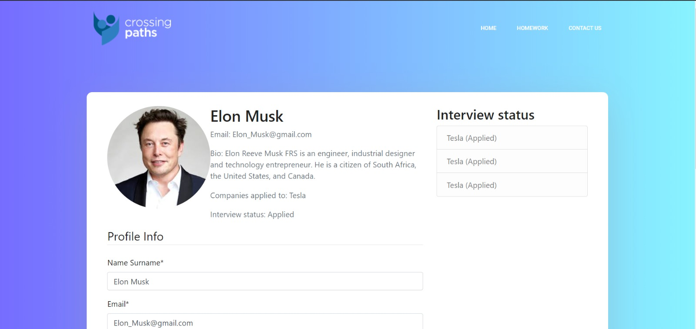

# Group-6 
**To do**
- [ ] combine all parts together
# Project description 🖥
This project aims to make job interviews online by creating a user-friendly website to solve coding questions using the hackerrank API. Find out more about the project  [here.](https://kesisenyollar.org/programlar/devpaths/)

# Libraries used for this project 📚
- [Django](https://www.djangoproject.com/)
- [Django-allauth](https://github.com/pennersr/django-allauth)
- [Django-crispy-forms](https://django-crispy-forms.readthedocs.io/en/latest/)
- [Heroku](https://www.heroku.com/)
- [Beautifulsoup4](https://pypi.org/project/beautifulsoup4/)

# Team members ✊
- [Amhar Jabeer](https://github.com/Ajabeer)
- [Mohammad Shughri](https://github.com/MXS11)
- [Patrick Twambilile Sibale](https://github.com/Twambie)
- [Yusuf Kılıç](https://github.com/yusufkilic96)

# Project progress 👨‍💻
- [First iteration](https://drive.google.com/file/d/15zk94OXDtCtNN4cH1IpfMtzmZiB988A1/view?usp=sharing)
- [Second iteration](https://drive.google.com/file/d/1S6MdIyo80X_SWQzmuZpct1nP5S6joTYn/view?usp=sharing)
- [Final iteration](https://drive.google.com/file/d/1rTVLGmWfide2lyrYyHYxJ7TQXuOIw4gh/view?usp=sharing)

# Screenshots 📸

